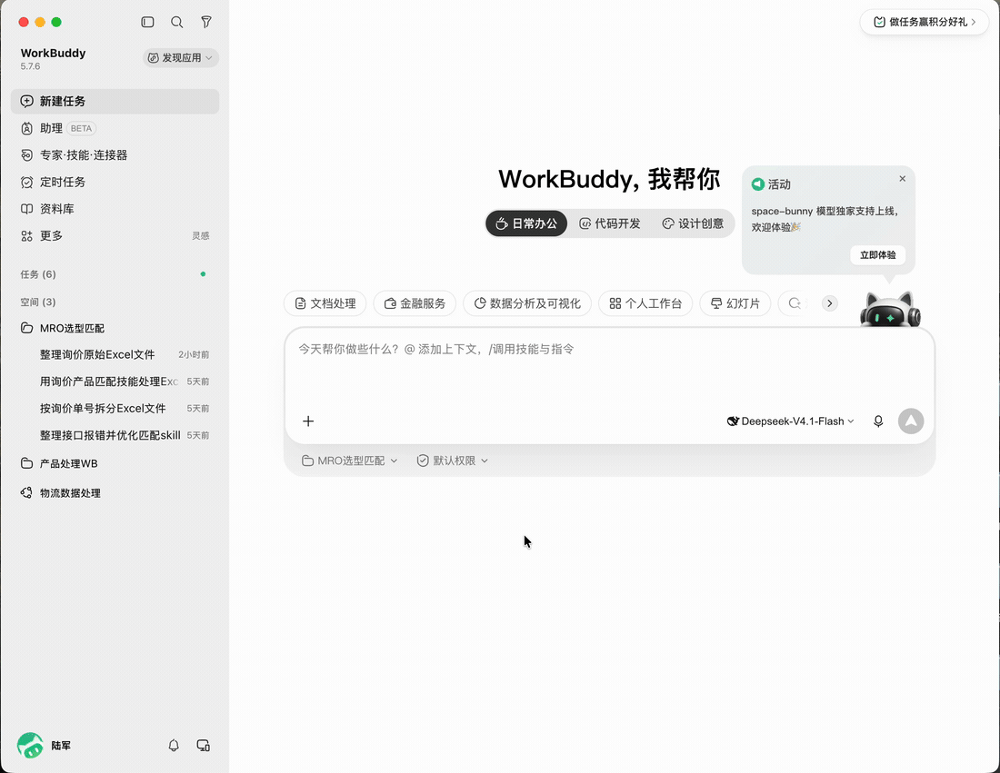

# MRO Inquiry Matching Skill / MRO 询价匹配 Skill

[](https://github.com/antscity-cn/mro-inquiry-match/stargazers)
[](LICENSE)

**MRO industrial supplies inquiry matching skill** for purchasing and technical teams. Give an agent a product description, MPN, standard, brand, or specifications; it searches connected industrial catalogs, checks categories and key attributes, and reports a preferred candidate, alternatives, and anything that still needs confirmation. It handles individual inquiries and Excel/CSV batches.



*Illustrative workflow for “六角盖形螺母 M8，A2，DIN 917”. The animation does not show live catalog results. Confirm final specifications, price, availability, and lead time with the original supplier.*

## Quick Start (English)

1. Register at the [Antscity MRO API platform](https://mro-api.ants-city.com), create an API key, and keep it in your agent's secret configuration or the `MRO_API_KEY` environment variable. Do not commit it to GitHub.
2. **Install from GitHub:** ask your agent to install [`skills/mro-inquiry-match`](skills/mro-inquiry-match) from this repository. The workflow is defined in [`SKILL.md`](skills/mro-inquiry-match/SKILL.md). For a manual Codex installation:

   ```bash
   git clone https://github.com/antscity-cn/mro-inquiry-match.git
   mkdir -p ~/.codex/skills
   cp -R mro-inquiry-match/skills/mro-inquiry-match ~/.codex/skills/
   ```

3. Connect your agent to the remote MCP endpoint `https://mro-api.ants-city.com/v1/mcp`. If your agent cannot use remote MCP but can run Python 3, use the included [REST client](skills/mro-inquiry-match/references/portability.md) with `MRO_API_KEY` instead.
4. Ask: `Use the MRO inquiry matching skill to find 六角盖形螺母 M8，A2，DIN 917. Check the category and key specifications before recommending a product.`

The API requires an account and key; live calls may consume account credit. See the [Chinese setup guide below](#快速开始) for more examples. Search terms: **mro skill**, **inquiry matching skill**, **industrial product matching**, **MRO purchasing**.

---

## 中文说明

蚁城公司推出的 MRO 工业品询价与选型辅助工具。

用户只需提供产品名称、型号、标准、品牌或规格参数，Skill 会调用蚁城 MRO API，在已接入的工业品资料中检索候选商品，逐步核对分类、品牌和关键规格，并给出首选商品、备选商品及需要人工确认的事项。

支持文字询价，也支持 Excel、CSV 批量询价。

> **使用说明**
>
> 本工具提供的商品匹配、规格判断、价格及选型结果仅供询价和选型参考。商品的最终规格、适用性、价格、库存、交期及其他交易信息，应以对应原始数据源和供应商最终确认为准。

## 适合哪些人员

- MRO 工业品采购人员
- 技术选型和设备维护人员
- 询价、报价及客服人员
- 需要批量整理客户需求的销售人员

无需了解 API、Elasticsearch 或程序开发。

## 可以完成什么工作

- 根据产品描述、品牌、型号或标准查找合适的工业品
- 根据分类、尺寸、材质等关键规格逐步筛选
- 从同一匹配层级中选择价格较低的商品
- 给出首选商品、最多 5 个其他匹配项和待确认事项
- 批量处理 Excel、CSV，并在原表后追加匹配结果

## 快速开始

### 1. 注册账号

访问 [蚁城 MRO API 平台](https://mro-api.ants-city.com)，注册并登录账号。

### 2. 创建 API Key

登录后打开“API 密钥”，创建并复制自己的 API Key。

API Key 相当于账号密码。请勿把它写进 GitHub、询价文件或公开聊天记录；优先通过 Agent 的密钥配置或环境变量保存。

### 3. 连接方式

支持远程 MCP 的 Agent 使用：

```text
https://mro-api.ants-city.com/v1/mcp
```

不能注册远程 MCP、但可以运行 Python 3 的 Agent，可使用 Skill 中的 `scripts/mro_api_client.py` 作为 REST 回退。设置 `MRO_API_KEY` 环境变量后，脚本可处理单条匹配、商品详情和本地并发批处理；详细用法见 [可移植性说明](skills/mro-inquiry-match/references/portability.md)。

### 4. 让 Agent 安装 Skill

将下面这段话发送给 Codex、WorkBuddy，或其他支持从 GitHub 加载 Skill 的 Agent：

```text
请安装并使用这个 MRO 询价匹配 Skill：
https://github.com/antscity-cn/mro-inquiry-match/tree/main/skills/mro-inquiry-match
```

如果使用 Codex，也可以手工安装：

```bash
git clone https://github.com/antscity-cn/mro-inquiry-match.git
mkdir -p ~/.codex/skills
cp -R mro-inquiry-match/skills/mro-inquiry-match ~/.codex/skills/
```

安装后重新启动或刷新 Agent，使 Skill 生效。

### 5. 提交询价

单条询价示例：

```text
请使用 MRO 询价匹配 Skill 查找：
六角盖形螺母，M8，A2，DIN 917。
```

带品牌和型号的示例：

```text
请使用 MRO 询价匹配 Skill 查找：
品牌 RS PRO，制造商型号 1234567，不锈钢六角螺母 M8。
```

批量 Excel 示例：

```text
请使用 MRO 询价匹配 Skill 处理这份询价表。
保留原始列，追加首选订货号、品牌、产品名称、人民币价格、
匹配状态、匹配依据、待确认事项、其他匹配项和数据源，最后导出 Excel。
```

## 结果包含什么

- 首选商品、订货号、品牌和制造商型号
- 商品名称及人民币参考价格
- 分类和规格匹配依据
- 精确匹配、替代推荐、待确认或未找到状态
- 需要采购或技术人员确认的问题
- 最多 5 个其他匹配项

资料不足以核实关键规格时，Skill 会标记“待确认”，不会直接判定为精确匹配。

## 如何提高匹配准确度

询价内容尽量包含以下信息：

- 产品名称
- 品牌
- 制造商型号或 MPN
- 执行标准
- 尺寸、材质等关键规格
- 不能接受的规格或品牌

客户自己的零件编码也可以保留，但不要把它当作制造商型号。信息不完整时仍可查询，Skill 会列出候选商品及缺少的确认信息。

## 数据说明

蚁城 MRO API 平台根据工业品询价和选型需求，对已接入的产品资料进行整理、检索和匹配。

不同数据源在商品名称、属性名称、计价方式和更新时间上可能存在差异。Skill 会尽量核对关键规格并说明匹配依据，但不会替代采购人员、技术人员或供应商的最终确认。

## 获取帮助

遇到 API Key 无法使用、没有返回候选、分类明显错误、规格筛选未生效或 Excel 无法导出等问题时，请联系蚁城 MRO API 平台维护人员，并提供已脱敏的询价内容和错误信息。

请勿在公开 Issue、截图或聊天记录中提交完整 API Key。

## 许可证

本仓库使用 [Apache License 2.0](LICENSE)。
